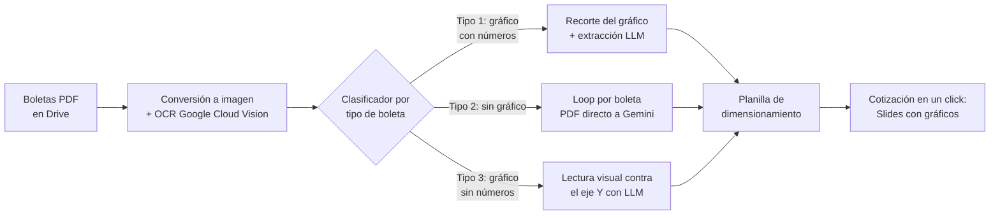

# Cotizador solar con OCR + LLMs: de horas a minutos por cotización

> **Case study** · Sistema en producción para [Solarbosch](https://solarbosch.cl), empresa instaladora solar chilena. El código no es público; este repo documenta el problema, la arquitectura y los resultados.

## El problema

Cotizar un proyecto solar residencial exigía que un ejecutivo comercial:

1. Pidiera al cliente su boleta de electricidad (PDF, a veces 12 boletas de un año completo).
2. Leyera y transcribiera a mano el consumo histórico, tarifa, potencia y datos del cliente.
3. Dimensionara el sistema fotovoltaico en una planilla.
4. Armara la presentación de la cotización con gráficos de consumo y generación.

El proceso completo tomaba horas por cliente y los errores de transcripción eran frecuentes. Además, cada distribuidora chilena (Enel, CGE, Energía de Casablanca, etc.) usa un formato de boleta distinto, y algunas ni siquiera imprimen los números sobre el gráfico de consumo.

## La solución

Pipeline automático de extracción + dimensionamiento + generación de cotización, operado desde un menú dentro de la propia planilla del ejecutivo:

Cómo funciona por dentro:

- **Árbol de decisiones por tipo de boleta:** una sola llamada de clasificación decide el flujo; los formatos "difíciles" (gráficos de barras sin números) se resuelven pidiendo al LLM leer las barras contra el eje Y.
- **Reglas de extracción como fuente de verdad:** las reglas de negocio (deduplicación de meses, cálculo del valor kWh sumando todos los cargos con kWh precisado, "nunca escribir un 0 silencioso") viven en un documento de reglas versionado que el equipo y los agentes de IA consultan antes de tocar el sistema.
- **Alta de clientes sin intervención humana:** un webhook desde el CRM (GoHighLevel) clona la planilla-plantilla completa (fórmulas + gráficos + script embebido) y crea la estructura de carpetas del cliente en Google Workspace.
- **Herramientas de diagnóstico:** funciones de auto-test que validan la captura de gráficos y vuelcan las especificaciones reales de cada gráfico, para detectar drift entre lo que muestra la UI y lo que persiste la API.

## Resultados

- La cotización pasó de horas a minutos y el sistema es la herramienta diaria del equipo comercial.
- Soporta boletas monofásicas y trifásicas de varias distribuidoras, incluyendo lotes de 12 o 13 boletas por cliente.
- Los datos van de la boleta al dimensionamiento sin transcripción manual.

## Lo que aprendí en el camino

- Google Apps Script corta la ejecución a los 6 minutos. Buena parte del diseño (clasificar una sola vez en lugar de pasar 12 PDFs por Vision) salió de esa restricción, no de una preferencia de arquitectura.
- Encontré un bug no documentado de Google Sheets: `chart.getBlob()` falla cuando las etiquetas personalizadas de un gráfico contienen números en lugar de strings. Causaba fallas intermitentes desde hacía semanas y se resolvió con pruebas A/B sistemáticas y fórmulas `TEXT()`. De paso descubrí que la API de Sheets no puede escribir `customLabelData` (devuelve error 500), así que hay configuraciones que solo se pueden hacer desde la interfaz.
- El separador de argumentos de las fórmulas (`,` o `;`) depende de la configuración regional de cada planilla, así que el instalador de fórmulas detecta el separador antes de escribir.

## Stack

Google Apps Script · Google Cloud Vision (OCR) · Gemini (extracción estructurada) · Google Sheets/Slides/Drive · GoHighLevel (CRM, webhooks)

---

*Nicolás Saratscheff · [github.com/Nicsar94](https://github.com/Nicsar94) · nicsaratscheff@gmail.com*
