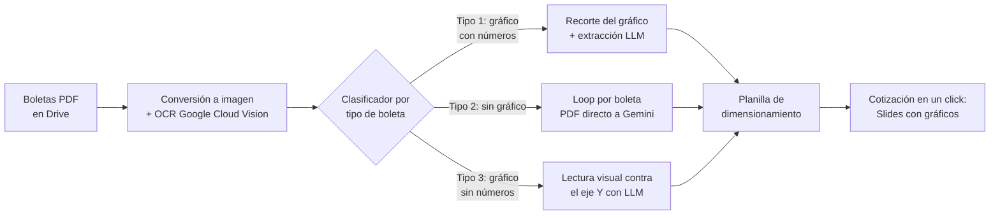

# Cotizador solar con OCR + LLMs: de horas a minutos por cotización

> Case study de un sistema en producción para [Solarbosch](https://solarbosch.cl), empresa instaladora solar chilena. El código no es público; este repo documenta el problema, la arquitectura y los resultados.

## El problema

Para cotizar un proyecto solar residencial, un ejecutivo comercial tenía que:

1. Pedirle al cliente su boleta de electricidad en PDF (a veces las 12 del año).
2. Leer y transcribir a mano el consumo histórico, la tarifa, la potencia y los datos del cliente.
3. Dimensionar el sistema fotovoltaico en una planilla.
4. Armar la presentación de la cotización con los gráficos de consumo y generación.

El proceso completo tomaba horas por cliente y los errores de transcripción eran frecuentes. Además, cada distribuidora chilena (Enel, CGE, Energía de Casablanca, etc.) usa un formato de boleta distinto, y algunas ni siquiera imprimen los números sobre el gráfico de consumo.

## La solución

Un pipeline que extrae los datos, dimensiona y genera la cotización, operado desde un menú dentro de la misma planilla que el ejecutivo ya usaba:

Cómo funciona por dentro:

- Una sola llamada de clasificación decide el flujo según el tipo de boleta. Los formatos difíciles (gráficos de barras sin números) se resuelven pidiéndole al LLM que lea la altura de las barras contra el eje Y.
- Las reglas de negocio viven en un documento versionado: cómo deduplicar meses repetidos entre boletas, cómo calcular el valor del kWh (sumando todos los cargos que precisan kWh, no solo el cargo por energía) y la regla de nunca escribir un 0 cuando una boleta no se pudo leer. Ese documento es la referencia obligada antes de tocar el sistema.
- El alta de clientes es automática: un webhook desde el CRM (GoHighLevel) clona la planilla plantilla completa, con fórmulas, gráficos y script incluidos, y crea la estructura de carpetas del cliente en Google Workspace.
- El sistema trae su propio diagnóstico: funciones de auto-test que validan la captura de gráficos y vuelcan la especificación real de cada uno, porque lo que muestra la interfaz de Sheets no siempre coincide con lo que persiste la API.

## Resultados

- La cotización pasó de horas a minutos y el sistema es la herramienta diaria del equipo comercial.
- Soporta boletas monofásicas y trifásicas de varias distribuidoras, incluyendo lotes de 12 o 13 boletas por cliente.
- Los datos van de la boleta al dimensionamiento sin transcripción manual.

## Lo que aprendí en el camino

- Google Apps Script corta la ejecución a los 6 minutos. Buena parte del diseño (clasificar una sola vez en lugar de pasar 12 PDFs por Vision) salió de esa restricción, no de una preferencia de arquitectura.
- Encontré un bug no documentado de Google Sheets: `chart.getBlob()` falla cuando las etiquetas personalizadas de un gráfico contienen números en lugar de strings. Causaba fallas intermitentes desde hacía semanas y se resolvió con pruebas A/B sistemáticas y fórmulas `TEXT()`. De paso descubrí que la API de Sheets no puede escribir `customLabelData` (devuelve error 500), así que hay configuraciones que solo se pueden hacer desde la interfaz.
- El separador de argumentos de las fórmulas (`,` o `;`) depende de la configuración regional de cada planilla, así que el instalador de fórmulas detecta el separador antes de escribir.

## Stack

Google Apps Script · Google Cloud Vision (OCR) · Gemini (extracción estructurada) · Google Sheets/Slides/Drive · GoHighLevel (CRM, webhooks)

---

*Nicolás Saratscheff · [github.com/Nicsar94](https://github.com/Nicsar94) · nicsaratscheff@gmail.com*
